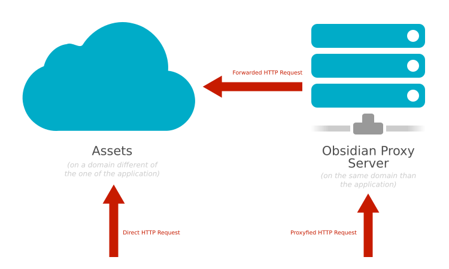

# Obsidian HTTP Request

[](https://github.com/wanadev/obsidian-http-request/actions/workflows/tests.yml)
[](https://www.npmjs.com/package/obsidian-http-request)
[](https://github.com/wanadev/obsidian-http-request/blob/master/LICENSE)
[](https://discord.gg/BmUkEdMuFp)


**Obsidian HTTP Request** is a helper library that allows you to download
assets and make HTTP requests either directly or through a proxy (to avoid CORS
issues, for example when using images from an other domain with a canvas).




## Install

To install Obsidian HTTP Request run the following command:

    npm install obsidian-http-request


## Documentation

You can find the library documentation at the following address:

* http://wanadev.github.io/obsidian-http-request/


## Example

```javascript
const httpRequest = require("obsidian-http-request");

httpRequest.getText("http://example.com/hello.txt")
    .then(function(result) {
        console.log(result);
    })
    .catch(function(error) {
        console.error(error);
    });
```


## Contributing

### Questions

如果您有任何问题,您可以:

* [在 GitHub 上开一个 issue][gh-issue]
* [在 Discord 上询问][discord]

### Bugs

如果您发现了 bug,请[在 Github 上开一个 issue][gh-issue],并提供尽可能多的信息。

### Pull Requests

在开始开发新功能之前,请考虑先[提交一个 bug][gh-issue]。这将允许我们讨论最佳的实现方式。当然,如果您只是想修复一些拼写错误或代码中的小错误,这就不是必要的了。

### 代码风格 / Lint

要检查代码风格,运行以下命令:

    pnpm lint

如果您是项目贡献者,请确保在提交代码之前运行此命令并修复任何 lint 错误。

注意: 我们使用 ESLint 的扁平配置系统。如果您需要修改 lint 规则,请编辑 `eslint.config.js` 文件。

### 测试

要运行测试,使用以下命令:

    npm test

[gh-issue]: https://github.com/wanadev/obsidian-http-request/issues
[discord]: https://discord.gg/BmUkEdMuFp


## Changelog

* **[NEXT]** (master 分支上尚未发布的更改):

  * 移除了 `q` 依赖,重构为使用原生 Promises
  * 更新了所有相关代码和测试以使用原生 Promises
  * 移除了 Grunt,使用更简单的方式进行测试和代码检查

* **v1.5.2:**

  * 用 mocha-headless-chrome 替换了已弃用的 mocha-phantomjs 来运行测试 (@jbghoul, 27)
  * 修复: 添加了缺失的 lodash 依赖 (@jbghoul, #28)

* **v1.5.1:**

  * Updated dependencies (@jbghoul, #26)

* **v1.5.0:**

  * Add a method to get the result as Blob (#20)

* **v1.4.0:**

  * Adds status code and message in Error objects (#19)

* **v1.3.2:**

  * Accepts 2xx HTTP status code and not only 200 (client side)

* **v1.3.1:**

  * Proxy do not returns an error anymore when server respond with 2xx stvatus code (#14)

* **v1.3.0:**

  * Log URLs in error messages

* **v1.2.0:**

  * Generic `request` and `requestProxy` method (to be able to use different methods than GET, with more options) #6
  * Proxyfied methods can now be used with relative links
  * Better documentation

* **v1.1.4:**

  * Updates dependencies
